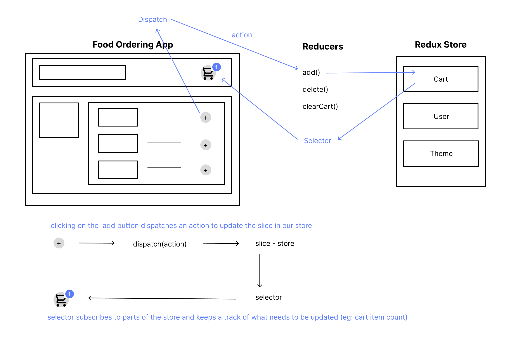

# Redux

- State management library. Redux enables creating a central store and actions to modify the store.
- Easily scalable, provides powerful dev tools for debugging, better code organization with separate UI and state management logic.

## Advantages of Redux Toolkit over Redux

- Redux toolkit is a set of tools that simplifies redux development. It is a friendly interface for redux
- Redux Toolkit was originally created to help address three common concerns about Redux:
	- "Configuring a Redux store is too complicated"
	- "I have to add a lot of packages to get Redux to do anything useful"
	- "Redux requires too much boilerplate code"
- Redux Toolkit makes it easier to write good Redux applications and speeds up development, by baking in our recommended best practices, providing good default behaviors, catching mistakes, and allowing you to write simpler code.

## Installation

- Core toolkit: `npm install @reduxjs/toolkit`
- API layer for react applications: `npm i react-redux`

### Redux Toolkit



#### Store

- A store holds the whole state tree of your application
- Its an object with a few methods
- There should only be a single store in your app
- Created using the configureStore API.
- https://redux-toolkit.js.org/api/configureStore

```javascript
import { configureStore } from "@reduxjs/toolkit";
import userSlice from "../slices/userSlice";

export default configureStore({
	reducer: {
		user: userSlice,
	},
});
```

#### Provider

Provide the store to the app at the top layer using a provider

- Provider comes from react-redux lib
- We wrap whole app inside a provider and we pass in the store

```javascript
import { Provider } from "react-redux";
import store from "./store/store.js";
import ThemeContext from "../contexts/ThemeContext.js";

const AppLayout = () => {
	return (
		<Provider store={store}>
			<ThemeContext.Provider>
				<div className="content">
					<Navbar />
					<Outlet />
				</div>
			</ThemeContext.Provider>
		</Provider>
	);
};
```

#### Dispatcher

- Dispatcher is used to dispatch an action and is the only way to update our store i.e. trigger a state change
- We can dispatch an action using the useDispatch hook
- Eg: adding new items to the cart: When we click the add button, we dispatch an action that is in our reducer to update the slice in our store.

```javascript
import { useDispatch, useSelector } from "react-redux";

const dispatch = useDispatch();

const updateTheme = () => {
	const newTheme = is_theme_light ? "dark" : "light";
	setTheme(newTheme);
};
```

#### Reducer

- A collection of functions used to update our slice
- In our store, the state is read-only. It can only be updated using special functions called reducers.
- Like the `Array.prototype.reduce` function, they take prev state and action as arguments and update the state. That's why we call them as reducers.
- When we click on Add button it doesn’t directly update the cart. It calls the reducer function to update the cart.
- So we need multiple reducer functions for CRUD operations. These functions are called as actions.
- Reducers are functions that take the current state and action as arguments and returns a new state
	`(state, action) => newState`
- We have one root reducer that is passed to the store which handles all the actions that are dispatched and calculates what the new state should look like

#### Slice

- Slice: sub object of redux store. A store can have small slices. We can have different slices for chunks of related data
- It helps us in separating out the store logic into different slices according to features.

**createSlice and its config**

- Accepts a single config object.
- A function that accepts a slice name, an initial state, and an object of reducer functions, and automatically generates action creators and action types that correspond to the reducers and state.

```javascript
import { createSlice } from "@reduxjs/toolkit";

const userSlice = createSlice({
   name: "user", // name of the slice
   initialState: { isLoggedIn: false, username: null }, // initial state for the reducer
   reducers: { // collection of all the actions required to update the slice
	   LoginUser: (state, action) => {
		   state.username = action.payload;
		   state.isLoggedIn = true;
	   },

	   LogoutUser: (state) => {
		   state.username = null;
		   state.isLoggedIn = false;
	   },
   },
});

export const { LoginUser, LogoutUser } = userSlice.actions;

export default userSlice.reducer;
```

#### Selector

- We dispatch an action from the reducer that updates the slice from the store and selector keeps a track of what component needs to be updated. Selector is like a consumer (useContext).
- Selectors are functions that accepts redux store as an argument and returns data that is based on the state
- They can be used anywhere where we want to access the store - Instead of accessing the store directly we use useSelector to access part of the store by subscribing to it. So if there is any change in the store we have the updated value.
- useSelector is invoked on every store's dispatch and it rerenders the component with new values whenever the selected value inside it is changed. eg: number of items in our cart: When we have to use data of our slice, we use it via selector.

```javascript
import { useDispatch, useSelector } from "react-redux";

const isLoggedIn = useSelector((store) => store.user.isLoggedIn);
```
